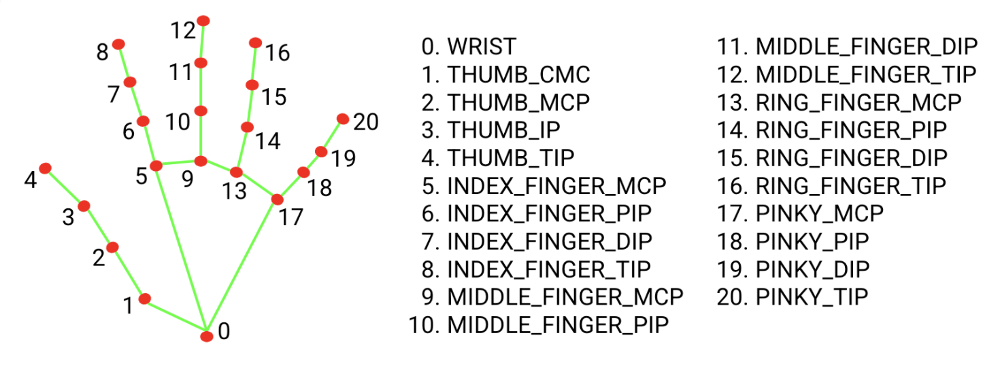
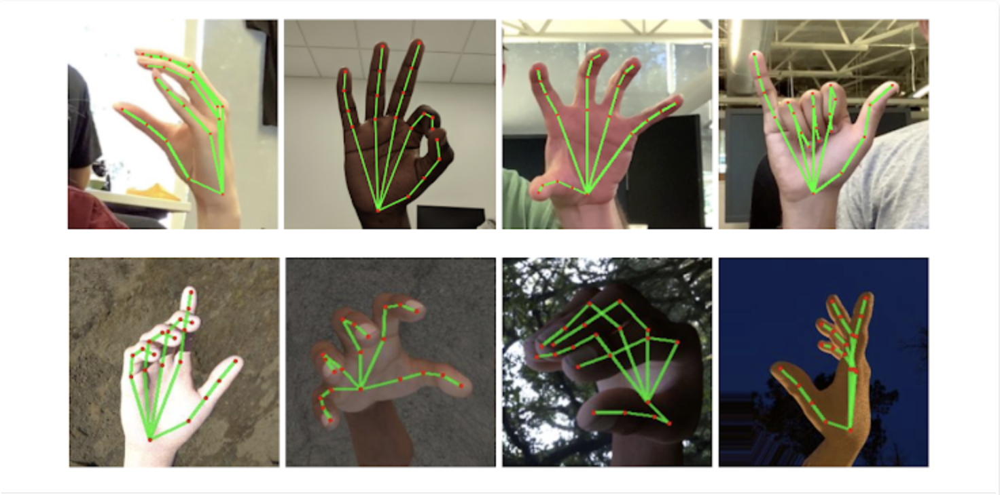

# Hands Detection

## MediaPipe Hands

The ability to perceive the shape and motion of hands can be a vital component in improving the user experience across a variety of technological domains and platforms. For example, it can form the basis for sign language understanding and hand gesture control, and can also enable the overlay of digital content and information on top of the physical world in augmented reality. While coming naturally to people, robust real-time hand perception is a decidedly challenging computer vision task, as hands often occlude themselves or each other (e.g. finger/palm occlusions and hand shakes) and lack high contrast patterns.

## Hand Landmark Model

 

## Result

